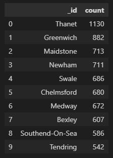

# nosql-challenge
Module 12 No-SQL challenge for UCI Data Analytics Bootcamp

Vincent Passanisi

Due January 12, 2023

# **Introduction**

This challenge required two deliverables. First, a notebook that set up the NoSQL database with establishment data including location and scores. A new restaurant was added and changes were made to the data types to allow later analysis. The second deliverable was an analysis. In this notebook, several questions were asked which required various queries, and the building of a query pipeline. The results are discussed below.

# **Files**

In the repository are the completed challenge files.

* *NoSQL_setup_final.ipynb* - my jupyter notebook with the set-up script for the NoSQL challenge.
* *NoSQL_analysis_final.ipynb* - my jupyter notebook with the analysis script for the NoSQL challenge, and answers to questions
* *Resources* folder with provided .json
    * establishments.json
* *output* folder with saved .csv files from created databases.
    * hygiene_20_est.csv
    * london_gte_4.csv
    * nearby_locations.csv
    * zero_hygiene.csv

# **Results**

*Deliverable 1: NoSQL Setup*

1. Exciting new halal restaurant in Greenwich was added to the database.

{
    "BusinessName":"Penang Flavours",
    "BusinessType":"Restaurant/Cafe/Canteen",
    "BusinessTypeID":"",
    "AddressLine1":"Penang Flavours",
    "AddressLine2":"146A Plumstead Rd",
    "AddressLine3":"London",
    "AddressLine4":"",
    "PostCode":"SE18 7DY",
    "Phone":"",
    "LocalAuthorityCode":"511",
    "LocalAuthorityName":"Greenwich",
    "LocalAuthorityWebSite":"http://www.royalgreenwich.gov.uk",
    "LocalAuthorityEmailAddress":"health@royalgreenwich.gov.uk",
    "scores":{
        "Hygiene":"",
        "Structural":"",
        "ConfidenceInManagement":""
    },
    "SchemeType":"FHRS",
    "geocode":{
        "longitude":"0.08384000",
        "latitude":"51.49014200"
    },
    "RightToReply":"",
    "Distance":4623.9723280747176,
    "NewRatingPending":True
}

2. The BusinessTypeID for "Restaurant/Cafe/Canteen" was found, and the BusinessTypeID and BusinessType fields were returned.

3. The new restaurant with the BusinessTypeID.

4. The magazine is not interested in any establishments in Dover, so any establishments within the Dover Local Authority were removed from the database.

5.  Latitude and longitude were converted to decimal numbers.

*Deliverable 2: NoSQL Analysis*

Which establishments have a hygiene score equal to 20? *There are **41** establishments with that score. Results are saved as **hygiene_20_est.csv** *

Which establishments in London have a RatingValue greater than or equal to 4? *There are **29** restaurants that fit this criteria. Results are saved as **london_gte_4.csv** *

What are the top 5 establishments with a RatingValue of '5', sorted by lowest hygiene score, nearest to the new restaurant added, "Penang Flavours"? *There are **2,115** establishments that fit this criteria. The complete dataframe is saved as **nearby_locations.csv**. * 

How many establishments in each Local Authority area have a hygiene score of 0? Sort the results from highest to lowest, and print out the top ten local authority areas. *There are **55** restaurants that fit this criteria. Results are saved as **zero_hygiene.csv**

Here is my result:

# **Comments and Thoughts**

A few small hiccups, but overall I felt pretty prepared to complete this challenge. In the first section, I had a bit of difficulty converting latitude and logitude to decimals, but it was mostly getting the syntax right. One small spelling mistake or missing bracket can ruin your whole day. :-)

The analysis was pretty straightforward. I had some trouble building my pipeline, but it was a matter of just using the right syntax again. I was using braces at one point instead of using brackets. The most difficult section for me was the nearby restaurants question, and once again, I was using the wrong type of brackets which kept me confused for about an hour. Overall, I enjoyed this challenge and learned a lot.
